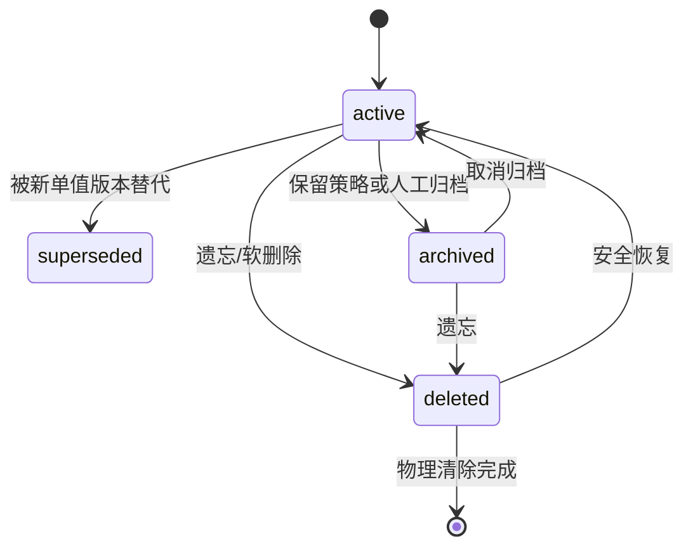

# 数据模型与存储

本文描述当前 schema 44 的逻辑数据模型。Conversation 权威表在 schema 32–36
逐步引入，schema 37 增加分层情景记忆，schema 38 增加可逆 Episode 索引精炼，
schema 39 加固正式 evidence 的数据库身份边界；schema 40–44 依次引入内容出生通道
（`memories.origin`）、可信会话签发（部门级隔离）、语料域分档（`memories.corpus_domain`）、
多租户可见性模型 v2（密级列 + 幂等键补 scope 维度）和公开 scope 通道。
本文不是可直接执行的迁移文件；真实结构、
列约束和迁移顺序以 `src/server/database.ts` 为准。

## 1. 存储原则

- SQLite 是权威持久层。
- 当前投影、规范真相、不可变版本、证据和派生摘要分开存储。
- 原始 evidence 不因生成摘要而删除。
- 关键身份和 project 绑定不可由自然语言或请求 body 改写。
- 派生索引可以重建，不作为唯一真相。
- 删除先 tombstone，物理清除由显式异步任务执行。

## 2. 核心实体关系

```mermaid
erDiagram
  ACCOUNT_PRINCIPAL ||--o{ AUTH_CREDENTIAL : owns
  ACCOUNT_PRINCIPAL ||--o{ CLIENT_PERSONA_BINDING : binds
  ACCOUNT_PRINCIPAL ||--o{ PERSONA_CHAT_PROFILE : owns
  ACCOUNT_PRINCIPAL ||--o{ CONVERSATION_PROJECT_BINDING : owns
  ACCOUNT_PRINCIPAL ||--o{ CONVERSATION_SESSION : owns
  CONVERSATION_SESSION ||--o{ CONVERSATION_TURN : contains
  CONVERSATION_SESSION ||--o{ CONVERSATION_EPISODE : groups
  CONVERSATION_EPISODE ||--|{ CONVERSATION_EPISODE_TURN : cites
  CONVERSATION_TURN ||--o{ CONVERSATION_EPISODE_TURN : included_in
  CONVERSATION_EPISODE ||--o{ CONVERSATION_MEMORY_SUMMARY_SOURCE : supports
  CONVERSATION_MEMORY_SUMMARY ||--|{ CONVERSATION_MEMORY_SUMMARY_SOURCE : cites
  CONVERSATION_SESSION ||--o{ CONVERSATION_ROUND : executes
  CONVERSATION_ROUND ||--o{ CONVERSATION_ROUND_ATTEMPT : retries
  CONVERSATION_ROUND ||--o{ CONVERSATION_ROUND_EVENT : streams
  CONVERSATION_TURN ||--o{ CONVERSATION_MESSAGE_ACTION : drives
  CONVERSATION_TURN ||--o{ EXTRACTION_RUN : triggers
  CONVERSATION_TURN ||--|| MEMORY_TURN_INGEST_ORDER : ordered_by
  MEMORY_REFLECTION_RUN ||--o{ MEMORY_REFLECTION_RUN_TURN : freezes
  CONVERSATION_TURN ||--o{ MEMORY_REFLECTION_RUN_TURN : included_in
  MEMORY_REFLECTION_RUN ||--o{ MEMORY_REFLECTION_MODEL_CALL : spends
  MEMORY_REFLECTION_RUN ||--o{ MEMORY_REFLECTION_EVENT : emits
  MEMORY_REFLECTION_RUN ||--o{ MEMORY_CANDIDATE : produces
  EXTRACTION_RUN ||--o{ MEMORY_CANDIDATE : produces
  MEMORY_CANDIDATE ||--o{ MEMORY_CANDIDATE_EVIDENCE : supported_by
  CONVERSATION_TURN ||--o{ MEMORY_CANDIDATE_EVIDENCE : quoted_from
  CONVERSATION_TURN ||--o{ MEMORY_PATTERN_OBSERVATION : observed_in
  MEMORY_REFLECTION_CLAIM ||--o| MEMORY_CANDIDATE : owns
  MEMORY_ITEM ||--o{ MEMORY_VERSION : versions
  MEMORY_VERSION ||--o{ MEMORY_EVIDENCE : grounded_by
  CONVERSATION_TURN ||--o{ MEMORY_EVIDENCE : supports
  MEMORY_ITEM ||--o{ MEMORY_EVENT : emits
  MEMORY_ITEM ||--o{ MEMORY_EDGE : relates
  MEMORY_ITEM ||--o{ MEMORY_TOMBSTONE : blocks
  MEMORY_ITEM ||--o{ PURGE_JOB : purged_by
  DERIVED_CONSOLIDATION ||--o{ DERIVED_SENTENCE : contains
  DERIVED_SENTENCE }o--o{ MEMORY_VERSION : cites
  RETRIEVAL_TRACE ||--o{ RETRIEVAL_TRACE_EVENT : records
  RETRIEVAL_TRACE ||--o{ RETRIEVAL_FEEDBACK : receives
```



图中名称是便于阅读的逻辑名；实际表名见下文。

## 3. 身份与会话表

| 表 | 作用 | 关键边界 |
|---|---|---|
| `account_principals` | 本地账户根 | status 可禁用；业务数据按 principal 隔离 |
| `auth_credentials` | Bearer 凭据哈希 | 不保存可恢复明文；状态 active/revoked/expired |
| `client_persona_bindings` | AIRI client/persona 稳定绑定 | schema 28 唯一键包含 principal |
| `identity_audit_log` | 身份成功、拒绝和失败事件 | 与业务 `audit_log` 分离 |
| `conversation_sessions` | 会话账本 | principal/persona/project 归属建立后不可变 |
| `conversation_turns` | 用户/助手 turn | session、round、role 提供幂等与顺序 |
| `persona_chat_profiles` | 角色聊天档案版本 | system prompt 与 capability 使用不可变 profile version |
| `conversation_project_bindings` | 当前账户的项目注册表 | external project ID 只在 principal/namespace 内有效 |
| `conversation_rounds` | 一条用户消息对应的权威生成轮次 | 同会话 single-flight、generation 和最终失败码 |
| `conversation_round_attempts` | 初次、重试和重新生成的执行尝试 | 持久 lease、heartbeat、attempt number 和 fencing |
| `conversation_round_events` | 可恢复 SSE 事件账本 | 事件有序、带过期时间；正文事件受删除清理约束 |
| `conversation_message_actions` | assistant 的结构化 emotion/motion | 固定注册表授权，不混入正文 |
| `conversation_changes` | 跨重启增量同步 change feed | principal/namespace 序列、资源版本和 tombstone |
| `conversation_lineage_keys` | fork/lineage 兼容键 | 保持分叉会话来源关系 |
| `turn_tool_events` | turn 内工具事件 | 还原工具调用证据 |
| `trusted_sessions` | 可信会话签发表（schema 41） | 服务对服务路径的部门级隔离；scope 绑定签发后不可变，吊销只置 `revoked_at`；`clearance` 为会话密级（schema 43） |

### 会话可信状态

- `complete`：具有可信稳定身份，可使用 personal/role/session/project 组合 scope。
- `degraded`：身份不完整，只允许更保守行为。
- `legacy`：旧数据，不能自动提升为可信 project 归属。

## 4. 自动提取与审核表

| 表 | 作用 |
|---|---|
| `extraction_runs` | 每次模型提取的输入指纹、模型、prompt、状态和错误 |
| `memory_candidates` | 原子候选、规范谓词、值、scope、置信和审核状态 |
| `candidate_resolution_runs` | 五路关系决策、方法、模型、置信和 rationale |
| `memory_action_requests` | 自然 remember/correct/forget 请求及人工审核租约 |

候选不是长期真相。只有人工接受或 `auto` 门禁通过后，才会写入规范记忆。

## 5. 规范记忆表

| 表 | 作用 |
|---|---|
| `memories` | 当前兼容投影，供 API、管理台和检索展示 |
| `memory_items` | 稳定 UUID、stable key、predicate、revision 和当前版本根 |
| `memory_versions` | 不可变版本内容、时间、scope、敏感级别和来源权威 |
| `memory_evidence` | 版本到 turn/source 的证据边；version/turn 身份不可换绑 |
| `memory_edges` | 规范记忆之间的语义关系 |
| `memory_relations` | 兼容投影关系 |
| `memory_events` | created/corrected/reverted/forgotten 等生命周期事件 |
| `idempotency_keys` | 用户、namespace、key 到 memory 的幂等映射 |
| `audit_log` | 业务操作审计 |

### 记忆行上的新增列（schema 40–44）

| 列 | 引入版本 | 取值与默认 |
|---|---:|---|
| `memories.origin` | 40 | 内容出生通道：`pipeline`（内核提取/治理管线，**默认**）或 `api`（认证 API 直写）。存量数据与备份导入一律落 `pipeline`（从严） |
| `memories.corpus_domain` | 42 | 语料域：`policy`（制度/合同）、`open`（开放语料）、`chat`（对话记忆）；`NULL` = 未标注，走全局默认门槛。召回重排时逐候选按域查相关性门槛 |
| `memories.classification` | 43 | 密级：`public` / `internal` / `confidential`；`NULL` 与存量行一律按 `internal`（从严，不放大可见范围） |
| `trusted_sessions.clearance` | 43 | 会话密级，缺省 `internal` |
| `scope_type` CHECK 枚举 | 44 | 补 `public`（可见性模型 v2 的 public 恒可见层依赖它） |

`idempotency_keys` 在 schema 43 重建：唯一键补 `scope` 维度。原 `(user_id, namespace, key)`
不含 scope，同一服务账号跨部门写同名 key 会静默去重丢数据；表级 PRIMARY KEY 无法
`ALTER`，因此照抄"建新表 → 拷数据 → 换名"模式。存量若存在同键映射到不同 scope 的行，
`INSERT OR IGNORE` 首行胜出——与旧行为语义一致，不放大丢失。

### 记忆类型

`profile`、`preference`、`project`、`event`、`knowledge`、`relationship`、
`instruction`。

### 状态



`superseded` 保留历史语义，不作为当前事实召回；`deleted` 对应 tombstone，
恢复前需要重新评估当前冲突。

## 6. 规范谓词与五路关系

`memory_items` 保存 `predicate_key`、`normalized_value`、
`normalized_value_hash` 和 `predicate_cardinality`。候选与当前事实可能为：

- `equivalent`：等价，通常合并。
- `reinforces`：强化，增加观察证据。
- `supersedes`：替代，关闭旧当前版本。
- `contradicts`：矛盾，自动或人工决策。
- `coexists`：时间、集合或上下文允许共存。

关系决策同时保存 rule/LLM 方法、模型、prompt 版本、置信、rationale 和错误，
可在记忆详情查看。

## 7. 索引与模型注册表

| 表 | 作用 | 是否可重建 |
|---|---|---|
| `memories_fts` | FTS5 词面索引 | 是 |
| `memory_ann_index` | 兼容 ANN 索引 | 是 |
| `memory_term_index` | 概念/规范词倒排 | 是 |
| `memory_embeddings` | generation 绑定的向量 | 是 |
| `memory_dense_lsh` | sign-LSH bucket | 是 |
| `embedding_model_registry` | 模型名、维度和指纹 | 注册信息需保留 |
| `dense_index_generations` | building/ready/active/failed generation | 受控重建 |
| `dense_index_aliases` | active/building/previous 原子别名 | 关键切换状态 |
| `dense_index_state` | 旧兼容水位状态 | 是 |

向量必须同时匹配 model、dimensions、fingerprint、text hash、memory revision 和
generation；不能只凭模型名字复用。

## 8. 巩固表

| 表 | 作用 |
|---|---|
| `derived_consolidations` | 某 scope 的派生摘要及 active/stale/quarantined 状态 |
| `derived_consolidation_sources` | 摘要引用的 memory version |
| `derived_consolidation_sentences` | 摘要逐句文本和支持判定 |
| `derived_sentence_sources` | 每句话到来源版本的多对多边 |

来源版本变化时派生摘要失效，而不是改写原子记忆。无支持句 quarantined，不能
用于可靠回答。

## 9. 治理表

| 表 | 作用 |
|---|---|
| `retention_policies` | principal/namespace/kind 的 TTL、半衰期和自动归档 |
| `memory_tombstones` | active 遗忘阻断、语义指纹和恢复世代 |
| `purge_jobs` | 物理清除租约、阶段、attempt 和错误 |
| `retrieval_feedback_examples` | used/confirmed/rejected 难例 |

tombstone 在软删除时立即阻止召回和同义复活；物理清除随后删除正文、证据、
索引和相关派生内容。外部备份不受数据库 purge 自动控制。

## 10. 任务与可靠性表

| 表 | 作用 |
|---|---|
| `outbox_events` | 与真相事务同提交的异步意图 |
| `memory_jobs` | 可租约、重试、延迟执行的任务 |
| `dead_letter_jobs` | 超出重试策略的原始故障证据 |

outbox 解决“事务已提交但任务没发出”，lease 解决 Worker 崩溃后任务永久卡住，
idempotency/revision 解决重放产生重复写入。

## 11. namespace 质量表

| 表 | 作用 |
|---|---|
| `namespace_quality_snapshots` | 固定评测结果、有效期和证据 |
| `namespace_rollout_state` | off/shadow/auto rollout 状态 |
| `namespace_recall_shadow_comparisons` | 新旧策略 shadow 比较 |

`auto` 是否允许提交由 namespace 的当前质量状态决定，不应仅凭全局环境变量。

## 12. 检索可观测性表

| 表 | 作用 |
|---|---|
| `retrieval_traces` | trace summary、query hash、scope、quality、耗时和错误 |
| `retrieval_trace_events` | 九种阶段的顺序事件；质量补救可按 attempt 重复部分阶段 |
| `retrieval_feedback_examples` | 与 trace/memory 绑定的正负难例 |
| `retrieval_log_state` | 每 principal 的 JSONL 成功/失败健康状态 |

metadata 模式默认不保存原查询文本；diagnostic 模式保存经脱敏文本，但仍应按
个人信息管理。

## 13. schema 版本重点

| 版本 | 关键变化 |
|---:|---|
| 25 | principal、凭据、persona 与身份审计 |
| 26 | project 固化到 session、身份列不可变、迁移 attestation |
| 27 | 九阶段 retrieval trace、反馈难例和日志健康 |
| 28 | persona binding 唯一键按 principal 隔离 |
| 29 | 历史重提炼表和候选来源过渡骨架 |
| 30 | 双 pipeline checkpoint、单调 ingest、冻结窗口、预算/claim/event 和 owner/scope attestation |
| 31 | ingest ledger 固化 `session_id`、session 增量索引、candidate evidence 真实 session scope attestation |
| 32 | Conversation 产品字段、角色档案、项目绑定、结构化动作和 HMAC cursor key；污染 assistant 历史会阻断迁移 |
| 33 | round、attempt、持久 lease/heartbeat、可恢复 SSE event 和同会话 single-flight |
| 34 | principal/namespace 内单调 change feed、资源版本快照和同步 tombstone |
| 35 | assistant 变体、active variant 唯一约束和幂等 regenerate request |
| 36 | 删除 receipt/barrier/evidence recompute、维护任务，以及 AIRI dry-run/commit 分批导入账本 |
| 37 | 每个完整 exchange 的情景记忆、跨窗行为观察，以及 session/day/week 来源化层级摘要 |
| 38 | 巩固/反思任务收口、Episode 冷却登记和可逆热索引精炼 |
| 39 | 正式 evidence owner/namespace/scope 触发器、身份不可换绑和启动污染扫描 |
| 40 | `memories.origin` 内容出生通道（pipeline/api），存量与导入一律从严落 pipeline |
| 41 | `trusted_sessions` 可信会话签发表（服务对服务，部门级隔离）；scope 签发后冻结，吊销置 `revoked_at` |
| 42 | `memories.corpus_domain` 语料域分档（policy/open/chat），召回重排按域取门槛 |
| 43 | 多租户可见性模型 v2：幂等键唯一约束补 scope 维度、`memories.classification` 密级、`trusted_sessions.clearance` |
| 44 | `scope_type` CHECK 枚举补 `public`，支撑公开通道（App/小程序匿名读） |

数据库的 `PRAGMA user_version` 必须由迁移代码维护。手工修改版本号不能建立可信
列、索引、触发器或 ledger，反而可能使服务 fail closed。

## 14. JSON 备份边界

完整 JSON v3 按当前 principal 导出：记忆、关系、审计、幂等、基础会话、turn、
候选、版本、证据、事件、outbox、jobs、dead letter、策略、tombstone、巩固、
历史重提炼 checkpoint/run/run-turn/model-call/claim/event/candidate evidence 和
purge 状态。

不作为便携内容导出的包括：

- 可恢复的明文 Token（系统本来也不保存）。
- 其他 principal 的数据。
- 目标库账户/凭据根和身份审计。
- 可重建 embedding/Dense 索引。
- JSONL 文件和外部进程日志。

导入要求 backup `userId` 与当前 principal 一致，并以目标库已有可信 session
绑定为锚；不能用 JSON 中的 `schemaVersion` 自证身份可信。

## 15. 数据目录

默认：

```text
data/
  memory-bridge.sqlite3
  memory-bridge.sqlite3-wal      # 运行时可能存在
  memory-bridge.sqlite3-shm      # 运行时可能存在
  logs/
    retrieval.YYYY-MM-DD.jsonl
```

迁移前备份文件可能与数据库同目录，名称包含旧/新 schema 和时间戳。不要在服务
运行时只复制主 `.sqlite3` 文件而忽略 WAL 一致性。

## 16. schema 32–36 会话权威表

### 角色、会话与消息

`conversation_sessions` 在原可信身份绑定上增加 title、active/archived/deleted、
资源 version、消息统计、角色档案版本、创建幂等键和 `deletion_generation`。
`conversation_turns` 增加单调 `message_sequence`、展示/规范化正文、消息状态、
客户端幂等键、payload hash、生成组、variant、active 标记和资源版本。

客户端不能直接决定 principal、namespace、消息顺序、round ID、active variant 或
角色档案版本。会话的 persona/project 绑定建立后仍不可变；切换角色或项目必须创建
新会话。

### round、恢复和同步

| 表 | 作用 | 关键合同 |
|---|---|---|
| `conversation_rounds` | 本轮权威状态和最终助手引用 | 同一 conversation 只允许一个非终态 round；`client_message_id` 幂等 |
| `conversation_round_attempts` | 物理模型执行尝试 | lease 到期后可收敛为 interrupted；generation 防晚到 completion |
| `conversation_round_events` | `turn.accepted/stage`、安全 delta、action、terminal event | `(round_id, sequence)` 严格有序；event ID 用于 `Last-Event-ID` 恢复 |
| `conversation_changes` | 会话/消息 upsert、delete 与 active variant 变化 | HMAC cursor 绑定 principal、namespace、用途和位置 |
| `conversation_regeneration_requests` | 重新生成幂等账本 | 旧 assistant 不修改；新变体完成事务中才切换 active |

`assistant.delta` 只保存已经过句级协议清洗、以后无需撤回的正文。最终完成时，历史
delta 拼接必须是最终 `display_content` 的逐字前缀；不一致以
`ASSISTANT_PROTOCOL_INVALID` 失败关闭。

### 删除与证据传播

| 表 | 作用 |
|---|---|
| `conversation_deletion_receipts` | 删除请求幂等结果、memory policy 和受影响资源摘要 |
| `conversation_deletion_barriers` | 至少 30 天的 round/conversation generation 屏障 |
| `conversation_deleted_evidence_proofs` | 删除正文后保留不可逆 turn hash 和 retained/revoked 证明 |
| `conversation_memory_recomputations` | 逐 memory 的 retained/recomputed/tombstoned 结果 |
| `conversation_maintenance_jobs` | 有界重算与延迟聊天正文 purge，含重试和 dead 状态 |

`retain_derived_memories` 删除聊天正文但把 evidence 转成无正文证明；
`forget_derived_memories` 撤销直接证据，唯一证据记忆 tombstone，多证据记忆追加由
剩余证据支持的新版本。历史 SSE/change 正文和 action 会同步清除，不能作为恢复通道
复活已删内容。

多证据重算会为新版本复制仍有效 evidence，不会移动旧行。原 turn 物理删除后只允许
原 evidence 的 `turn_id` 由外键清空；禁止改绑另一 version 或 turn。

### AIRI 历史导入

| 表 | 作用 |
|---|---|
| `conversation_import_states` | importId + dry-run/commit lane 的下一批位置和完成状态 |
| `conversation_import_receipts` | 每批 payload hash、输入/输出 cursor 和去正文统计 |
| `conversation_import_sessions` | external session 到权威 conversation 的幂等映射 |
| `conversation_import_messages` | external message/round 到权威 turn 的幂等映射 |

dry-run 和 commit 是两条独立 lane；commit 必须从空 cursor 开始。同 cursor 同 payload
只重放原 receipt，不同 payload 返回冲突；last batch 后不能追加。导入 turn 默认
`lifecycle suppressed`，不会意外重复提取，若要重提炼必须显式创建 reextract/reflect run。

`conversation_cursor_keys` 保存当前/上一代 32-byte HMAC key，用于分页、change 和 import
cursor 的防篡改与平滑轮换。它是实例级秘密，不进入 API 响应或公开备份。

## 17. schema 30/31 历史重提炼表

| 表 | 作用 | 关键合同 |
|---|---|---|
| `memory_turn_ingest_order` | 为每个 owner/namespace/session 的 turn 分配单调顺序 | 扫描不用 `occurred_at` 做水位；schema 31 固化 session 归属并命中 session 增量索引 |
| `memory_reflection_settings` | namespace 的 off/shadow 和每日预算 | 不存在 inference auto 模式 |
| `memory_reflection_checkpoints` | scope/run type/generation 独立成功水位 | reextract 与 reflect 不共享 checkpoint |
| `memory_reflection_runs` | 窗口、模型、实现、租约、状态和计数 | run 幂等键绑定 turn set + generation |
| `memory_reflection_run_turns` | 冻结 turn ID、ordinal、alias、ingest seq、content hash | 重试不能重选窗口 |
| `memory_reflection_model_calls` | 每次物理调用的预算预留和结果 | reserved/completed/failed/refunded 可审计 |
| `memory_reflection_claims` | scope 内规范 claim 单写者注册表 | 唯一键防并发/跨版本重复并保存拒绝抑制 |
| `memory_reflection_events` | run 和 model-call 状态事件 | 不保存窗口正文或模型完整输出 |
| `memory_candidate_evidence` | 候选到逐字 turn 摘录的多证据边 | owner/namespace/scope 必须与候选和 turn 一致 |

`memory_candidates` 在 schema 30 增加：

- `reflection_run_id`：产生或最近关联该候选的运行。
- `candidate_origin`：`turn_extraction/history_reextract/reflection`。
- `claim_fingerprint`：scope 内语义 claim 去重键。

`memory_reflection_claims` 是并发和跨版本去重权威，不能用“先 SELECT 再 INSERT”
替代。相同 fingerprint 的新版本只合并尚不存在的 evidence；候选被 rejected 或
blocked 后，后续版本不得重新创建可见候选。

checkpoint 只有在 run 的候选/证据最终持久化事务成功时前移。partial、failed、
dead、cancelled 或 token-budget blocked 不得跳过 turn。`lastIngestSeq` 是执行
正确性水位，`lastTurnOccurredAt` 仅用于展示和语义窗口。

证据 TTL 可以把 `memory_candidate_evidence.excerpt` 擦为 NULL，同时保留不可逆
hash、计数和 claim。正文被擦除后候选仍可用于审计，但不能再人工确认。物理清除
会覆盖关联 run-turn、evidence、claim 引用和受管备份中的可识别正文，并保持其他
principal 完全不变。

## 18. schema 37–38 分层情景记忆表

| 表 | 层级 | 作用与约束 |
|---|---|---|
| `conversation_episodes` | L1 | 一个完整 user/assistant exchange 对应一行；两个来源 turn 均唯一，并保存 owner、namespace、session、scope、时间和内容哈希 |
| `conversation_episode_turns` | L1 | episode 到两个来源 turn 的顺序边；ordinal 0 为 user，1 为 assistant |
| `memory_pattern_observations` | L2 | claim fingerprint 下的跨窗支持、反证、替代或阻断观察；同 turn 幂等去重 |
| `conversation_memory_summaries` | L4 | session/day/week 摘要版本，带 bucket、scope、来源指纹、模型和 prompt |
| `conversation_memory_summary_sources` | L4 | 摘要到 L1 episode 的有序来源边；摘要不能无来源存在 |
| `conversation_episode_compactions` | 治理 | 记录已被有效 week 摘要覆盖并卸载热索引的旧 Episode；保存删除行数和验证时间，摘要失效时可恢复 |

L1 和 L4 同时在 `memories` 中有可检索投影，但有效性由上述来源表决定。删除、
遗忘或来源失效会先阻断召回，再由治理任务重算或清除。FTS 在 L1 事务内同步可用；
Dense 是可重建派生索引，Worker 按 generation 增量补齐，队列尾部再执行 scope 全量
水位核验，避免每条索引任务重复扫描整个账户。

`conversation_episode_compactions` 不是删除证明。表中 Episode 的原始 turn、L1 投影、
版本、证据和 FTS 仍存在；只有 embedding、Dense LSH、ANN 和 term 热索引被卸载。
Dense eligible/indexed 水位和启动修复必须排除这些冷项。有效 week 摘要失效后，登记
会被移除并触发本地索引恢复和持久 Dense 重建任务。

## 19. schema 39 正式证据边界

`memory_evidence_owner_insert` 校验带 `turn_id` 的 evidence 与目标 memory version、
owner、namespace 以及 personal/role/project/session scope 一致。
`memory_evidence_identity_update` 禁止事后修改 `memory_version_id`，也禁止把已有
`turn_id` 换成另一条 turn；仅允许被引用 turn 已删除后把它清空。

启动会核对两条触发器的规范 SQL 并扫描既有证据错配。削弱或缺失的触发器会重装，
但已经污染的数据库会 fail closed，不能靠手工修改 `PRAGMA user_version` 洗成可信库。

## 20. schema 40–44 多租户可见性与公开通道

**横向（scope）× 纵向（密级）正交。** scope 决定"哪一片数据"，密级决定"这一行对谁可见"，
两者独立判定、缺一不可。

- **可信会话（schema 41 / 43）**：`trusted_sessions` 承载服务对服务路径的部门级隔离。
  可签发 scope 类型为 `project` / `role` / `public`（部门以 `project:<部门>` 形式在授权
  矩阵中表达）；`scopes` 签发即冻结，吊销只置 `revoked_at`，历史不删。默认上限 32 个活跃
  会话、TTL 3600 秒（可配 60–86400）、单会话最多 16 条 scope。授权矩阵来自
  `MEMORY_BRIDGE_SESSION_GRANTS_FILE` 指向的配置文件（主体 → scopes + clearance），
  行级判定见 [多租户隔离设计](design/multi-tenant-isolation.md)。
- **密级（schema 43）**：`memories.classification` ∈ `public` < `internal` < `confidential`，
  `NULL` 一律按 `internal`（从严，不放大可见范围）。读取时只返回密级序**不高于**读者
  `clearance` 的行；`public` 为匿名公开层，`confidential` 需会话 `clearance=confidential`。
  密级与 `sensitivity`（内容保护语义）不是一回事，互不推导。
- **公开通道（schema 44）**：`scope_type` 的 CHECK 枚举补 `public`，供 App/小程序匿名只读
  场景；公开层仍然受 tombstone、来源有效性和密级过滤约束，不是"绕过可见性"。
- **升级语义**：40–44 全部只做加法与"建新表→拷数据→换名"，不重写历史行；`PRAGMA user_version`
  仍必须由迁移代码维护。
