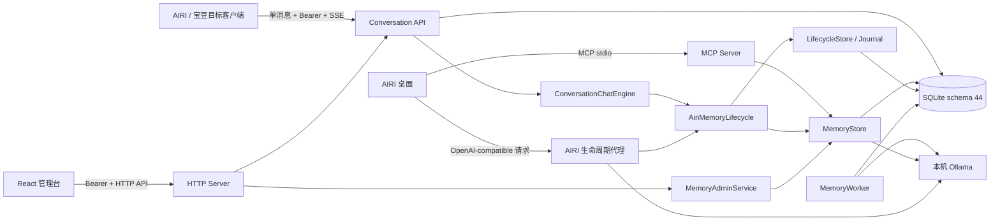
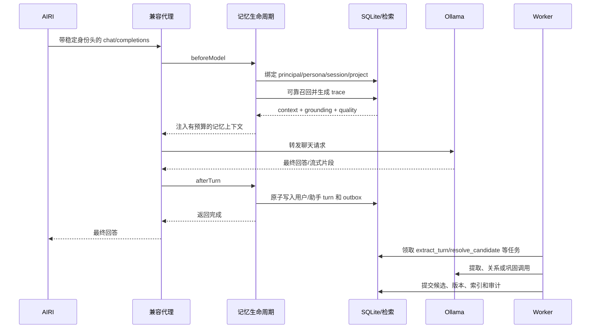
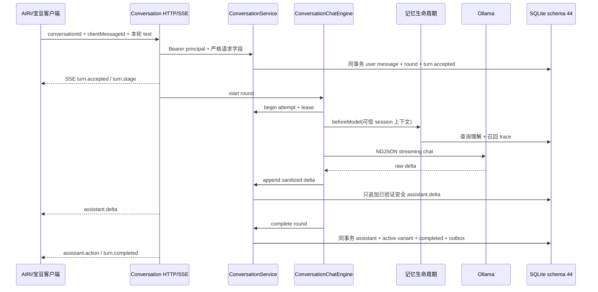

# 技术实现参考

本文解释忆桥当前代码如何运行，面向架构、后端和排障人员。产品层概念先读
[架构与记忆模型](architecture.md)，表级说明见[数据模型](data-model.md)。

## 1. 技术栈与进程

- Node.js 24+，使用内置 `node:sqlite`。
- TypeScript 服务端；React 19 + Vite 管理台。
- `@modelcontextprotocol/sdk` 提供 MCP stdio。
- Ollama 提供聊天、提取、关系、意图、巩固、embedding 和重排模型。
- SQLite 是真相库、任务账本、审计链和派生索引的统一持久层。

主要进程：

| 进程 | 入口 | 责任 |
|---|---|---|
| HTTP/Worker | `src/server/index.ts` | 管理 API、Conversation API、AIRI 兼容代理和后台 Worker |
| MCP stdio | `src/server/mcp-stdio.ts` | 固定 principal、namespace、scopes 的七个 MCP 工具 |
| 开发前端 | Vite | 5173 管理台，代理 3789 API |
| Ollama | 外部本机服务 | 11434 模型推理 |

## 2. 运行时拓扑



HTTP 与 MCP 可以同时访问同一数据库，但每个请求/连接都先确定 principal；MCP
连接还在启动时固定 namespace 和可见 scopes。
后台 Worker 通过 SQLite 租约竞争任务，不依赖内存队列保存关键状态。

## 3. AIRI 兼容路径一轮对话



回答前召回是同步路径；回答后沉淀先持久化证据和 outbox，再异步执行。即使
进程在模型回答后崩溃，任务仍可从 SQLite 重放。

兼容代理不盲信回答模型使用 grounding 的结果。对私有稳定事实：

- 可信召回会以 `根据长期记忆：……` 确定性返回。
- full 零召回会精确返回 `不知道。`。
- 世界知识/建议 hard negative 不进入上述强制分支。
- 只对 `consolidation` 来源剥离严格首行 provenance，其他用户正文不被误删。
- 四个 `_airiMemory*` 内部字段在生命周期前从客户请求删除，客户端不能
  伪造 grounded/empty 状态或 traceId。

### 3.1 Conversation API 一轮对话



`ConversationService` 在 schema 36 引入，当前运行于 schema 44，是会话状态机和事务边界；
HTTP handler 不直接拼业务
SQL。相同 `clientMessageId` + 相同 payload 重放已有 round，不重复调用模型；同 ID 异
payload 冲突。同会话 partial unique index 保证最多一个非终态 round。

`ConversationChatEngine` 把 beforeModel、provider 和完成事务串联，并用持久 attempt
lease/heartbeat。服务重启后由 reconciliation 把无法证明完成的过期 attempt 收敛为
`interrupted`。客户端可查询 round，或在事件保留期内用 `Last-Event-ID` 恢复 SSE。

Ollama NDJSON 先进入 `StreamingAssistantProtocolSanitizer`。只有完整安全句可成为
持久 delta；ACT、工具包装和可疑协议不进入正文。完成时重新解析完整响应，并要求历史
delta 拼接为最终正文的逐字前缀；失败时不写 assistant 权威消息或 extraction outbox。

## 4. 身份与作用域

### 4.1 principal

HTTP principal 只能由 Bearer 凭据解析；body/query 中的 `userId` 或
`principalId` 会被拒绝。MCP 进程启动时用 `MEMORY_BRIDGE_MCP_TOKEN` 或
`MEMORY_BRIDGE_USER_ID` 固定 principal，并用启动环境固定 namespace 与
persona/project/session scopes；工具参数不能改写或扩大这些边界。未完整绑定
persona + session 的旧客户端安全默认只有 `personal/self`。

Conversation HTTP 的 tenant 来自认证上下文，persona/project/session 来自服务端
会话行；请求消息、`recentTurns`、模型输出和自定义 header 都不能建立或覆盖这些边界。

### 4.2 persona、session 与 project

AIRI 兼容代理消费稳定的 client、persona、session、round 头，并可携带
project 头。schema 28 将 persona 绑定唯一性收紧为
`principal + client_type + client_instance_id + persona_id`，相同 AIRI 稳定 ID
不会在不同账户间共享绑定。

当前 v1 身份合同为 `x-memory-bridge-context-version`、
`x-airi-character-id`、`x-airi-session-id`、`x-airi-round-id`，以及可选
`x-airi-project-id`。前四者不完整时只保留 personal 读取，不形成生命周期写入。

session 的 principal/persona/project 归属一旦建立即不可变：

- 切换 persona 或 project 必须新建 session。
- fork 继承原 session 的 project 绑定。
- 旧 metadata 不会被提升为可信 project 归属。
- v26 迁移遇到无法证明归属的 legacy project scope 会 fail closed。

### 4.3 scope 可见性和遮蔽

| scope | 可见范围 | 同谓词优先级 |
|---|---|---:|
| `personal/self` | 同一 principal | 0 |
| `project/{project_id}` | 同 principal、同 project 会话 | 1 |
| `role/{persona_id}` | 同 principal、同 persona | 2 |
| `session/{session_id}` | 当前 session | 3 |

一次 AIRI 完整身份召回会组合当前可见 scope。相同规范谓词出现冲突时，更具体
scope 遮蔽更宽 scope；不同谓词仍可共同返回。

## 5. 自动记忆流水线

1. `AiriMemoryLifecycle` 记录会话与 turn，解析显式自然意图。
2. 完整 user/assistant exchange 提交后，`LifecycleStore` 同时写 outbox；第一阶段
   `materialize_episode` 不调用 LLM，幂等生成 L1 情景、turn 来源和 FTS 投影。
3. 情景事务再排 `index_memory` 和 `summarize_memory_bucket`；前者补 Dense，后者按
   session/day/week 生成有来源的 L4 摘要。派生失败不删除 L0/L1。
4. 独立的 `extract_turn` / `resolve_candidate` 流水线由 `OllamaMemoryExtractor`
   输出原子 claim，而不是把整段聊天直接提升为稳定事实。
5. `NamespaceGatedCandidateResolver` 先跑确定性规则，再调用关系分类模型；关系结果为
   equivalent、reinforces、supersedes、contradicts 或 coexists。
6. `shadow` 将候选放入收件箱；`auto` 只提交通过 namespace 与安全门禁的候选。
7. 提交保持稳定 memory UUID，追加 `memory_versions`，绑定 evidence 和 event；合格的
   跨窗口弱信号先进入 observation，达到独立证据门槛后才交给反思器验证。
8. 事实、情景和摘要统一进入混合召回，但使用独立配额和来源标签；情景不得伪装为
   “已验证用户事实”，摘要不得成为证明自身的循环证据。

凭据级敏感内容不会保存为长期记忆。歧义、低置信、冲突和需要具体目标的遗忘
进入人工动作收件箱。

## 6. 规范记忆与版本

`memories` 是管理台和兼容接口使用的当前投影，`memory_items` 是稳定真相项，
`memory_versions` 是追加版本。更新时：

- UUID 不变。
- 旧当前版本关闭，新版本成为 current。
- correction/supersede 不覆盖原始证据。
- `expectedRevision` 可用于乐观并发。
- 恢复删除记忆前重新计算等价/强化/冲突；冲突恢复使用快照绑定确认 Token。

所有关键写入使用 SQLite 事务。授权遗忘在 `BEGIN IMMEDIATE` 后重读 owner、
namespace、状态和 exact scope，tombstone、事件、索引移除和审计同事务提交。

`memory_evidence.memory_version_id` 与有值的 `turn_id` 是版本级证据身份。可靠召回的
grounding 只汇总当前 `memory_items.current_version_id` 对应的可信用户证据；历史版本
各自保留自己的 summary/evidence。删除多证据记忆时通过追加新版本并复制剩余证据
重算，不能把旧 evidence 移动到另一 version 或 turn。

数据库连接启用 WAL、`synchronous=NORMAL`、64 MiB 有界页缓存、256 MiB mmap 和
内存临时表。页缓存按连接惰性使用，mmap 是地址空间上限，不会在启动时一次性读取
整个数据库；这些参数用于避免百万级数据库在多次证据/版本索引读取时退化。

## 7. 混合检索

可靠召回不会先截取最近 1000 条。候选通道包括：

- SQLite FTS5 词面检索。
- 本机 embedding 与 sign-LSH Dense/ANN。
- 规范词/概念倒排。
- 一跳关系图扩散。
- 可选查询改写产生的多个 query variant。

候选经过融合、最低语义相似过滤、`qwen2.5:14b` 批量严格重排、scope 遮蔽、
派生摘要覆盖折叠、多样性与上下文预算后才注入模型。反馈只在相关性门槛之后
提供最大 0.04 的有界先验。
“最近/昨天/上周/本月”等有唯一含义的时间词会生成确定性软排序计划，同时作用于
粗排和最终排序；时间优先取当前版本可信用户证据，再取事件/观察/更新时间。它不会
硬过滤稳定事实，多个冲突时间范围会放弃计划而不是猜测。
这里的重排模型与 AIRI 聊天模型是两个独立角色。AIRI 代理使用
`MEMORY_BRIDGE_AIRI_CHAT_MODEL`，默认同样为 `qwen2.5:14b`，但运行时可分开替换。

`required` 模式中语义链失败会返回 `unavailable`，不会静默退回宽松词面结果。
`degraded` 表示部分质量条件未满足；调用方应按响应 abstention 处理。

## 8. 九种阶段可观测性

每次可靠召回记录：

1. `request`
2. `rewrite`
3. `channels`
4. `fusion`
5. `semantic`
6. `rerank`
7. `selection`
8. `context`
9. `result`

SQLite 中的 trace summary/events 是权威诊断链；JSONL 是可选旁路导出。一次
trace 完成时批量追加 JSONL 并更新健康状态，写日志失败不回滚记忆真相。
质量补救在同一 traceId 中按 attempt 重复 rewrite～selection，因此九种阶段不等于
固定九条事件；每条事件含阶段耗时和稳定原因码。
兼容层另生成 requestId，通过响应头返回 requestId/traceId，并在
`zero_recall_abstention`、`grounded_recall_repair` 和 `proxy_result` 审计中保存
`retrievalTraceId`，从而将最终回答与九阶段 trace 直接关联。

## 9. 后台任务与恢复

主要 job type：

- `materialize_episode`
- `summarize_memory_bucket`
- `extract_turn`
- `resolve_candidate`
- `index_memory`
- `backfill_dense_index`
- `evaluate_dense_index`
- `consolidate_memory_change`
- `consolidate_scope`
- `consolidation_sweep`
- `retention_sweep`
- `purge_memory`
- `reflection_sweep`
- `reextract_turn_window`（payload 绑定已冻结的 runId）
- `reflect_turn_window`（payload 绑定已冻结的 runId）

任务带状态、优先级、下次执行时间、租约、attempt 和最大重试次数。超出策略的
失败进入 dead letter，恢复会生成可追踪的新任务并保留旧故障证据。周期任务
使用稳定链收敛：全局 consolidation 一条，每个 principal/namespace 的
retention 一条。

schema 37 引入的情景管线是两阶段队列：Conversation outbox 先物化 L1，再由已提交的
episode 事务排 Dense 与 L4 摘要任务。因此物化阶段 `jobs` 暂时增长是派生工作被显式
持久化，不等于 dead job；验收看最终到期 outbox/jobs 是否归零、failed/dead 是否为零。

schema 38 在写入和启动迁移两处收口重复后台工作：同一 memory 只保留最新
`consolidate_memory_change` 后继，同一规范 scope 只保留最新 pending/failed
`consolidate_scope`，running 和显式 recovery 不被误杀；已经终止的 reflection run
对应遗留 job 会完成收口。这是合并重复工作，不是删除未处理的真实任务或失败证据。

每天的 `retention_sweep` 还会调用 `refineEpisodeIndexes`。超过热窗口且被 active
week summary 覆盖的 Episode 会登记到 `conversation_episode_compactions`，并在同一
事务删除 embedding、Dense LSH、ANN 和 term 热索引。Dense 水位和启动索引修复都会
排除这组冷 Episode。摘要失效时删除精炼登记、同步恢复本地 ANN/term，写
`episode_rehydrated` outbox，再由 Worker 重建 Dense。

Reflection 窗口执行时 Job lease 与 Run lease 使用同一租期并同步 heartbeat。
所有续租、失败回写和最终提交都按 Worker ID fencing；过期 Worker 不能覆盖新
Worker 的状态。后继 `reflection_sweep` 的 payload 持久化
`scopeDiscoveryWatermark`，scope 发现只扫描该水位之后、当前高水位之前的 ingest
ledger；session/role/project 选窗固定从会话索引开始，避免按 scope 重扫全账户
历史。

## 10. Dense generation 生命周期

embedding 不只按模型名缓存，还绑定模型注册、维度、指纹、文本哈希、revision
和 generation。替换 embedding 时：

1. 注册 building generation。
2. 批量回填并维护 eligible/indexed 水位。
3. 在不可变 generation 上运行固定评测。
4. 标记 ready。
5. 原子切换 active alias，并保留 previous。
6. 出现回归时原子 rollback。

这避免“换模型后半库是旧向量、半库是新向量”而健康接口仍显示正常。

单条 `index_memory` 在队列非尾部只写本记忆的 embedding/LSH，不重复扫描整个
owner/namespace。当前 scope/generation 的到期索引任务清空后，队尾任务才执行一次
全 scope 水位核验并标记 generation ready；未来 `available_at` 的任务不阻塞当前水位。
直接批量回填仍会在批次结束时执行完整水位核验。这一语义避免 N 条索引退化为 N 次
全库扫描，同时保留 ready 状态的完整性证明。

## 11. 非破坏式巩固

派生摘要不是新的无来源真相：

- 逐句保存支持它的 `memory_version_id`。
- Provider 先生成，再逐句验证支持关系。
- 无来源句会 quarantined，不参与可靠召回。
- 来源被纠正、遗忘或变化后摘要 stale，之后可重建。
- 召回时派生摘要覆盖的原子结果可以折叠，但原子版本仍保留。

## 12. 数据库迁移与 attestation

当前 `SCHEMA_VERSION = 44`：

- v26：可信 session/project 绑定、身份列不可变触发器和迁移 ledger。
- v27：retrieval trace、事件、反馈难例和日志健康。
- v28：persona 绑定唯一性增加 principal 维度。
- v29：历史重提炼表和候选来源过渡骨架。
- v30：双 pipeline checkpoint、单调 ingest、不可变 run-turn、模型调用预算、
  语义 claim、事件链和 owner/scope attestation。
- v31：为 ingest ledger 固化可信 `session_id`、增加 session 增量索引，并在
  数据库层对 candidate evidence 的 owner/namespace/scope 做 fail-closed 约束。
- v32–v36：逐步引入 Conversation 权威会话、消息、round/SSE、删除、导入、维护任务
  和 attestation；schema 36 是 Conversation API 的完整迁移基线。
- v37：加入 L1 情景、情景 turn 来源、L2 pattern observation、L4 session/day/week
  摘要及来源表，并把事实、情景和摘要纳入统一可追溯召回。
- v38：增加巩固/反思任务收口、`conversation_episode_compactions` 冷却登记和
  可逆 Episode 索引精炼；37→38 迁移会重新安装 v32/v33/v35/v36 会话保护触发器。
- v39：38→39 先生成迁移备份并保留全部 evidence，再安装
  `memory_evidence_owner_insert` 与 `memory_evidence_identity_update`。启动会校验
  规范触发器 SQL、重装同名削弱触发器并扫描污染 evidence；已污染数据库 fail closed。
- v40：`memories.origin` 标记内容出生通道（`pipeline` 内核管线 / `api` 认证 API 直写）；
  存量行与备份导入一律落 `pipeline`，从严。
- v41：新建 `trusted_sessions`（服务对服务的可信会话签发）与
  `trusted_sessions_principal_idx`；scope 签发即冻结，吊销只置 `revoked_at`。
- v42：`memories.corpus_domain` 标注语料域（`policy`/`open`/`chat`），重排时逐候选按域
  取相关性门槛；`NULL` 走全局默认。
- v43：多租户可见性模型 v2——`idempotency_keys` 按"建新表→拷数据→换名"补 `scope`
  维度，新增 `memories.classification`（密级，默认 `internal`）与
  `trusted_sessions.clearance`。
- v44：`scope_type` 的 CHECK 枚举补 `public`，支撑 App/小程序匿名只读的公开通道。
- 迁移惯例：v40 起的每个版本块开头都会无条件 DROP 全部会话触发器，因此**必须**
  重装 v32/v33/v35/v36 四组结构化触发器，否则升级库会因触发器缺失而断言失败。

打开更高版本数据库会拒绝降级运行。迁移在事务内执行，并在需要时生成迁移前
SQLite 备份；v26 关键结构还会验证列、索引、触发器 SQL 和 ledger，不能靠
手工改 `user_version` 绕过。

## 13. 一致性和失败边界

| 失败位置 | 系统行为 |
|---|---|
| Ollama 聊天失败 | 代理返回错误，不伪造最终回答 |
| embedding/重排失败 | `required` 召回返回 unavailable/degraded，不注入不可靠结果 |
| 回答后 Worker 失败 | job 重试，最终进入 dead letter；turn/outbox 已持久化 |
| JSONL 写失败 | 召回仍返回；日志健康累计错误 |
| 进程崩溃 | 未完成租约到期后可重放，幂等键避免重复提交 |
| 恢复输入不可信 | 导入事务回滚，不先删除目标数据 |
| legacy project 归属不明 | 迁移 fail closed 并保留备份 |
| evidence owner/scope 错配或 version/turn 换绑 | SQLite 触发器直接 ABORT，不发布半成品 |

## 14. 关键源文件

| 文件 | 责任 |
|---|---|
| `src/server/index.ts` | 依赖装配、启动、Worker 和安全关闭 |
| `src/server/config.ts` | 运行时配置的事实源：环境变量、默认值、弃答档位与语料域门槛 |
| `src/server/http-server.ts` | HTTP、静态前端和 AIRI 路由 |
| `src/server/mcp-server.ts` | MCP 工具定义与调用编排（对外首选接口） |
| `src/server/conversation-http.ts` | Conversation 严格 HTTP/SSE 契约和稳定错误 |
| `src/server/conversation-service.ts` | 会话、消息、round、change、删除、导入和 Doctor |
| `src/server/conversation-chat.ts` | beforeModel、provider 流式、完成/失败事务和审计 |
| `src/server/assistant-protocol.ts` | 展示正文与结构化动作的完整/增量清洗 |
| `src/server/airi-ollama-compat.ts` | OpenAI/Ollama 兼容与生命周期代理 |
| `src/server/airi-memory-lifecycle.ts` | 回答前/后记忆编排 |
| `src/server/memory-store.ts` | 规范记忆、可靠召回、备份与投影 |
| `src/server/lifecycle-store.ts` | 会话、outbox、jobs 和 dead letter |
| `src/server/hybrid-retrieval.ts` | 混合检索与 Dense generation |
| `src/server/semantic-ranker.ts` | embedding 和严格批量重排 |
| `src/server/contextual-query-understanding.ts` | 回答前上下文依赖检测、结构化消歧和安全校验 |
| `src/server/memory-reflection.ts` | 双 pipeline 选窗、run、预算、候选证据和 checkpoint |
| `src/server/retrieval-observability.ts` | trace、JSONL 和日志健康 |
| `src/server/episodic-memory-service.ts` | L1 情景物化、L2 观察与 L4 摘要的编排 |
| `src/server/hierarchical-summary-service.ts` | session/day/week 层级摘要的生成、来源绑定与失效 |
| `src/server/answer-tools.ts` | 答案工具（calculator / date_diff / date_shift）与弃答联动 |
| `src/server/trusted-sessions.ts` | 可信会话签发、授权矩阵解析、密级与部门级隔离判定 |
| `src/server/database.ts` | schema、迁移、触发器规范 attestation 和 evidence 完整性扫描 |

## 15. 不应误解的边界

- `200 /api/health` 不等于可靠召回健康。
- MCP 可调用不等于 AIRI 自动生命周期已启用。
- 固定小数据集 100% 不等于线上成功率 100%。
- soft delete/tombstone 不等于所有外部备份已擦除。
- 本地优先不等于本机上所有进程天然可信。

## 16. 上下文理解与历史重提炼内部合同

### 16.1 查询理解调用路径

`AiriMemoryLifecycle.beforeModel()` 从可信会话账本读取最近消息；MCP 的
`recentTurns` 只作为 `request_untrusted` 语义输入。`ContextualQueryUnderstandingService`
执行：检测 → 消息/token 裁剪 → credential redaction → single-flight → 最多一次
Ollama 结构化调用 → 确定性校验 → `QueryUnderstandingResult`。

`standaloneQuery` 只有在 `status=resolved`、置信度达标、所有 `resolvedText`
逐字出现且 supporting turn 有效时才进入 ranking。约束字段不能自证：否定、
时间、频率、条件和模态还必须出现在独立查询本文。两个同谓词人称先行词强制
`ambiguous`。模型生成的澄清句经过单行、长度和危险指令模式过滤，否则使用固定
模板。

可靠召回保留原查询，并将结构化结果交给多查询候选和严格重排。首轮候选很多但
全部低质或被重排拒绝时仍可触发质量补救，但同一 owner/session/round/context
hash 只允许一次物理理解调用。

### 16.2 反思运行状态机

```text
pending → running → completed
                  ↘ failed → retry → pending
                  ↘ dead
pending/running → cancelled
```

run 在排队时写入不可变 `memory_reflection_run_turns`，包含 ordinal、ingest sequence、
临时 alias 和 content hash。执行时重新读取真实 turn 并验证 owner、namespace、
scope、role 和 hash；重试不重新选窗。

每次物理模型调用先在 `BEGIN IMMEDIATE` 内检查每日预算和同 owner/namespace
并发槽，再写 `reserved` 账本与事件。完成或失败更新同一 call；失败调用不伪装成
退款。运行提交前重查 lease、取消、TTL、tombstone、scope 和 evidence。

`reextract` 逐 turn 调用现有 extractor，先在内存暂存整个窗口；任一调用失败时
零候选发布。全部成功后才在一个事务中创建 extraction run、候选、claim/evidence、
解析 job 和 checkpoint。

`reflect` 只接收同 scope 的 user turn。Provider 结果必须至少三个不同 turn、每个
excerpt 逐字存在；credential、内部 redaction 占位符、医学/心理诊断式推断直接
拒绝。通过后写 `assistant_inference/pending`，没有自动提交路径。

claim 唯一键为 owner + namespace + scope + normalized claim fingerprint。
它在 `BEGIN IMMEDIATE` 内取得单写者所有权：相同版本重放无副作用；跨版本等价
结果只合并新 evidence；rejected/blocked 决策抑制后续版本。人工确认/拒绝使用
状态比较更新，并把候选、claim、tombstone、版本和 outbox 保持事务一致。

### 16.3 失败与可观测性

- `preview` 纯只读，分别返回两条 pipeline 的窗口和 blocked turn。
- status 总览取 worst lag；每条 `pipelineLags` 保留具体 scope/run type。
- partial/failed/dead/cancelled 不推进 checkpoint。
- 事件和模型调用账本不保存完整历史窗口或完整模型输出。
- evidence TTL 可将 excerpt 置空并保留哈希/计数；失去正文的候选不能确认。
- Memory Doctor 检查孤儿、owner/scope 错配、checkpoint 超前、过期租约、预算
  保留、重复 claim 和内容哈希异常。
