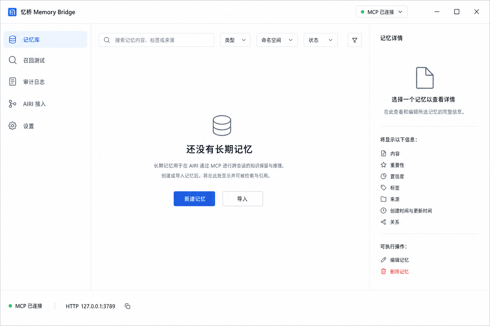

# 管理台界面使用手册

管理台默认地址为 [http://127.0.0.1:3789](http://127.0.0.1:3789)。它是本地
SQLite 真相库的管理界面，不使用演示数据；页面展示的是当前凭据所属账户的
真实数据。

## 1. 顶部与底部状态

- “本地服务已连接”：前端能访问 HTTP 服务并通过当前身份验证。
- “需要账户令牌”：当前页面没有有效 Token，输入 `mb1.…` Token 后继续。
- “本地服务未连接”：服务未启动、端口不对或请求失败。
- 页面每 15 秒刷新一次基础健康状态。
- 底部 `MCP stdio 已就绪` 是构建能力提示，不代表某个 AIRI 进程已经建立 MCP
  会话；实际连接仍需在 AIRI 中配置。

## 2. 账户令牌页

首次建立凭据后，受保护页面会显示“连接你的本地账户”。输入 Token 后点击
“进入记忆库”。

注意：

- Token 只存在当前页面的 JavaScript 内存中。
- 刷新、关闭页面或点击“清除本页令牌”后需要重新输入。
- 忆桥数据库只保存不可逆哈希和末尾提示，无法找回旧明文 Token。
- 丢失 Token 时可用本机身份 CLI 签发新 Token，见[命令参考](command-reference.md)。

## 3. 记忆库

### 3.1 搜索与筛选

顶部可以按以下条件组合筛选：

- 内容、标签或来源关键词。
- 类型：档案、偏好、项目、事件、知识、关系、指令。
- namespace。
- 作用域：个人共享、Persona 私有、聊天私有、项目绑定。
- 作用域稳定 ID。
- 状态：active、superseded、archived、deleted。

选择作用域后才可输入作用域 ID；个人共享会自动使用 `self`。右侧清除筛选
按钮会一次恢复全部条件。

### 3.2 新建和编辑

“新建记忆”支持内容、标题、摘要、类型、namespace、标签、重要度、置信度和
来源。内容应写成脱离当前对话仍能理解的完整事实。

手工编辑会保留记忆 UUID，并生成新的不可变版本。标题留空时由内容首行生成。
手工表单默认创建普通、个人共享记忆；更精细的 scope、时间和来源权威字段
可通过 HTTP API 或自动生命周期写入。

### 3.3 详情抽屉

点击一条记忆后可以查看：

- 当前内容、摘要、类型、namespace、scope 和状态。
- 敏感级别、来源权威、肯定/否定语义、发生时间与有效期。
- 重要度、置信度、来源、创建/更新时间和最后召回时间。
- Pin、TTL、归档原因和 retrieved/used/confirmed/rejected 计数。
- 标签、记忆关系和五路关系判断审计。
- 派生摘要的逐句来源与隔离状态。
- 全部版本、原始证据、会话来源和生命周期事件。

schema 37 会让记忆库里出现三类可召回条目：普通规范记忆是“已验证事实”；
`conversation_episode` 是每个完整问答自动形成的“过往对话情景”；
`hierarchical_summary` 是 session/day/week 的“派生摘要”。情景数量通常远大于稳定
事实是正常现象，它解决“聊过但没晋升成画像就永远找不到”的问题。不要手工把所有
情景改成 preference；稳定画像仍必须通过严格提取、证据和版本门禁。

可在详情中提交“已使用”“正确”“不正确”反馈。反馈只在相关性门槛之后提供
有界排序先验，不会把无关结果强行提升为命中。

### 3.4 删除、恢复与物理清除

- “归档”：停止正常召回，但保留数据，可恢复归档。
- “删除”：写 tombstone 并变为 deleted，可在“已删除”筛选中恢复。
- “恢复”：若与当前单值事实冲突，会先显示冲突并要求二次确认。
- “物理清除”：排队删除正文、证据、索引和派生内容；这是高风险操作。

物理清除后，已导出的旧备份仍可能包含该内容，必须单独治理备份。

### 3.5 导入与备份

“备份”导出当前账户的完整 JSON v3 备份。“导入”会用备份替换当前账户的
对应状态，不是追加合并；执行前必须确认。详见[备份与恢复](backup-and-restore.md)。

## 4. 待确认

此页同时处理两类收件箱：

1. 自动提取的记忆候选。
2. 自然语言触发的记住、纠正、遗忘动作。

候选可以先编辑规范内容和值，再接受；也可以拒绝。选择“拒绝并阻止以后再次
记住”会写 tombstone，适合用户明确不希望系统保存的事实。

对于纠正和遗忘：

- 纠正前核对目标记忆、候选值和模型置信度。
- 遗忘动作必须选择具体目标，避免仅凭模糊搜索词删除错误事实。
- 低置信、冲突、敏感或目标不明确的动作不应盲目接受。

`shadow` 模式下这里会积累候选；`auto` 模式仍会把不满足安全门槛的候选留在
这里供人工处理。

历史重提炼候选会额外标记“历史直接重提取”或“跨多轮推断”，并显示证据数、
会话数、时间跨度、模型/Prompt 版本和最小必要摘录。跨多轮推断的来源权威固定
为 `assistant_inference`；只有人工确认后才会成为 `user_confirmed` 规范版本。

## 5. 召回测试

输入与真实聊天相同的自然问题，可选 namespace。结果分为：

- 查询与质量状态：`full`、`degraded` 或 `unavailable`。
- 命中记忆：最终分数、词面/ANN/概念排名、语义相似、重排置信、时效和多样性。
- 实际上下文：真正会注入 AIRI 的文本，不等于所有候选。

结果和实际上下文会分别标出 fact/episode/summary。若同一问题同时命中稳定事实和大量
情景，分层配额会优先保留事实并限制情景/摘要数量；这不是“少召回”，而是防止长时间
使用后数万条 episode 淹没当前事实。展开 grounding 可追到具体 turn/episode/version。

`full + 0 条` 是可信的零结果，不代表用户绝对从未说过；`unavailable` 表示可靠
语义链不可用，本轮不会用宽松词面结果冒充可靠记忆。需要逐阶段定位时使用
返回的 traceId 和[检索日志手册](retrieval-logging.md)。

“逐调用检索日志”按 attempt 展示 rewrite、embedding/semantic 和 rerank 的真实
执行路线：确定性快路、模型或缓存；同时显示 provider 调用数、请求/模型耗时、
cache hit、single-flight 合并、cold/warm、prompt/output token 和不可逆调用指纹。
展开“调用明细”可检查同一阶段的每个物理调用。下方时间线按同一个 traceId 展示
request、rewrite、retrieval、fusion、semantic、rerank、selection、context、result；
质量补救会重复部分阶段，因此“九阶段”不等于永远只有九行。

## 6. 系统状态

此页用于运维，不要只看顶部绿色连接状态。重点区域：

- 索引水位：active、FTS5、ANN、概念、embedding、Dense eligible/indexed/lag。
- 自动化：平均提取延迟、失败、过期摘要和隔离摘要。
- 模型角色：提取、巩固、embedding 和重排模型。
- 任务队列：pending/running/retrying/failed/dead letter。
- 最近任务尝试与补偿：attempt/maxAttempts、终态、输入/输出/错误指纹、模型耗时、
  recovery strategy、compensation action 和 no-op reason。
- 死信历史：恢复后仍保留原始故障证据。
- Dense 双索引世代：building/active/previous 和别名切换状态。
- 派生巩固、tombstone、物理清除任务。
- schema 37 分层覆盖：episode、FTS、Dense、session/day/week 摘要及来源健康。

未来时间的 retention/consolidation 周期任务显示 pending 是正常现象。发布门禁
应关注 lag、未解决 dead letter、retrying、stale/quarantined、outbox 和日志
健康，而不是简单要求所有 pending 为零。

分层管线是两阶段任务：`materialize_episode` 完成后才出现 `index_memory` 和
`summarize_memory_bucket`，所以导入或长时间轴回放中 jobs 会先上升再下降。只有到期
outbox/jobs 长时间不下降、出现 failed/dead，或 Doctor 报
`episode_dense_unindexed`/`summary_source_incomplete`，才应视为故障。

## 7. 审计日志

审计页按时间展示操作、记忆 ID 和结构化详情，适合回答“谁对哪条记忆做了
什么”。它与九阶段检索 trace 不同：

- 审计日志追踪业务状态变化和召回行为。
- retrieval trace 追踪一次召回内部经过哪些检索阶段。
- 任务/死信追踪后台异步执行。

三者的查看方式见[日志查看总览](logging-guide.md)。

## 8. AIRI 接入

该页根据当前项目路径和配置生成：

- 安装、构建和启动命令。
- MCP stdio 配置。
- OpenAI-compatible Base URL 与聊天模型。
- 最终联调标准。

复制前先确认页面中的项目目录、Node 路径、数据目录和账户信息属于目标环境。
完整步骤见[AIRI 接入与验收](airi-integration.md)。

## 9. 账户

“账户”是安全边界，不等同于 persona。此页可以：

- 首次初始化账户和首枚凭据。
- 签发、查看提示、撤销凭据。
- 查看已绑定 AIRI persona、客户端、最近 session 和私有记忆数量。
- 选择 persona/session 执行当前账户的组合召回。

组合召回按当前会话可见 scope 查询，并以更具体的 scope 遮蔽冲突；它不会跨
principal 读取。切换 persona 或 project 必须由 AIRI 新建 session，不能在旧
session 中改写绑定。

撤销当前页面正在使用的凭据会立即退回令牌页。撤销前最好先签发并保存另一枚
有效凭据。

## 10. 设置

设置页包含：

- 本地数据目录、默认用户、namespace、HTTP 地址和自动化模式。
- 各模型角色的当前值。
- 完整备份导出。
- 按 namespace/记忆类型设置证据 TTL、低权重半衰期和自动归档。
- 本地与隐私边界说明。

保留策略不会绕过 Pin、档案和长期指令保护；自动归档也不是物理删除。环境变量
不能在此页修改，需停止进程后按[配置参考](configuration-reference.md)重新启动。

## 11. 常见界面问题

| 现象 | 处理 |
|---|---|
| 刷新后要求 Token | 这是内存存储设计，重新输入 Token |
| 页面绿色但召回不可用 | 查看“系统状态”的模型和质量，不要只看 HTTP 连接 |
| 记忆库空 | 首次启动本就为空；确认账户、namespace 和筛选条件 |
| 待确认一直增加 | 当前可能是 `shadow`，人工审核或完成评测后切 `auto` |
| 找不到 persona | 先让 AIRI 通过生命周期代理发送带稳定身份头的真实会话 |
| 恢复要求二次确认 | 当前存在冲突，核对将被替代的活跃事实 |
| 导入按钮提示替换 | 完整恢复是替换当前账户状态，不是增量追加 |
| JSONL 没增长 | 查看“系统状态”和 `/api/retrieval-log/health`，再检查目录权限 |

更完整的处理步骤见[故障排查](troubleshooting.md)。

## 12. 历史重提炼

此页同时管理 `reextract` 和 `reflect`，不是普通“重新生成摘要”按钮。

### 12.1 概览

- 运行模式：`shadow` 或已关闭。关闭只停止新 sweep/run，不删除旧记录。
- 今日模型调用：已用/上限；失败调用也计入真实成本。
- 待处理 ingest lag：使用全部 scope/pipeline 中最落后的一条。
- 运行健康：running、failed/dead 和 checkpoint 数量。

### 12.2 创建运行

1. 选择 namespace。
2. 选择 `personal/project/role/session`；personal 固定使用 `self`，其他类型输入
   AIRI 可信身份产生的稳定 ID。
3. 点击“预览窗口”。预览不写候选、run 或 checkpoint。
4. 分别查看“待事实重提取”和“待跨轮反思”的 turn、token 和调用量。
5. 只启动需要的 pipeline；两条按钮按各自窗口启用，互不遮蔽。

出现红色超长 turn 提示时，窗口停在该 turn 之前，checkpoint 不会跳过。应先
缩小单次内容、调整受控预算或治理该 turn，再重新预览；不要把按钮禁用误解为
“所有历史都处理完了”。

### 12.3 运行记录和账本

点击运行可查看：

- 模型、Prompt、generation、尝试次数和最后错误。
- pending/rejected 候选数量。
- 每次物理模型调用的 reserved/completed/failed/refunded 状态和估算 token。
- `queued`、`started`、`model_call_reserved/completed/failed/refunded`、
  `completed/failed/dead/cancel_requested/cancelled` 等完整事件链。

`refunded` 只用于模型尚未派发的调用；如果已经把请求交给模型，即使随后取消，
账本也会记为 `failed`，避免低报真实成本。

pending/running 可取消；failed/dead 在修复根因后可重试。取消或失败不会推进
checkpoint。界面只显示脱敏结构化详情，不显示完整模型输出和整个历史窗口。

### 12.4 与“待确认”“召回测试”的关系

`reflect` 结果在“待确认”页审核；确认、修正后确认、拒绝和“以后别再记”都在
那里完成。`reextract` 结果继续经过既有 Resolver 和 namespace 安全门禁。

“召回测试”会展示上下文查询理解状态、上下文来源、原查询/独立查询和澄清结果。
当出现两个同等可能先行词时，正确行为是要求澄清且零记忆注入；不要把它当成
召回故障。使用 traceId 可以继续定位 rewrite、候选、重排和最终注入阶段。
